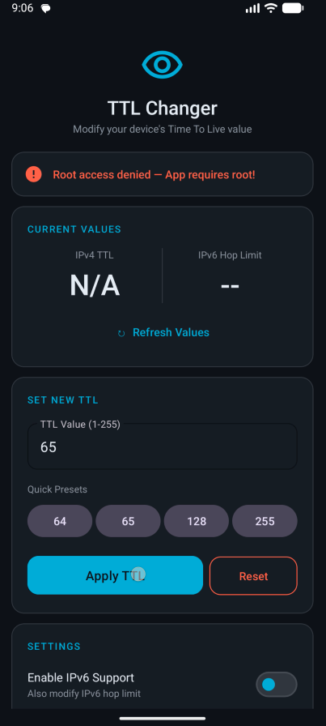

# TTL Changer 1.0

A simple yet powerful Android application that allows you to change the **TTL (Time to Live)** value on your rooted device.

## 📸 Screenshots

<p align="center">
  
</p>

## ⚡ Features

- **📖 Read & Write TTL** — Instantly read the current IPv4 TTL value and write a new one
- **🌐 IPv6 Support** — Toggle IPv6 hop limit modification alongside IPv4 TTL
- **🔁 Apply on Boot** — Automatically apply the last saved TTL value when your device boots up
- **📱 One-Tap Widget** — Add a home screen widget to apply your saved TTL value with a single tap
- **⚡ Quick Presets** — Common TTL values (64, 65, 128, 255) available as one-tap presets
- **🔄 Reset** — Instantly reset TTL back to default (64) with iptables cleanup

## ⚠️ Requirements

- **Rooted Android device** — The app requires root (su) access to modify system network parameters
- **Android 7.0+** (API 24+)
- **Superuser manager** (Magisk, SuperSU, etc.)

## 🛠️ How It Works

The app modifies the following system files via root shell commands:

| Feature | System Path |
|---------|-------------|
| IPv4 TTL | `/proc/sys/net/ipv4/ip_default_ttl` |
| IPv6 Hop Limit | `/proc/sys/net/ipv6/conf/all/hop_limit` |

Additionally, it sets **iptables/ip6tables** rules in the `mangle` table's `POSTROUTING` chain for session-level persistence.

## 📦 Building

1. Open the project in **Android Studio**
2. Sync Gradle
3. Build & Run on a rooted device/emulator

```bash
./gradlew assembleDebug
```

## 📱 Widget

Long-press on your home screen → Widgets → **TTL Quick Apply** → Add to home screen. Tap the widget to instantly apply your saved TTL value.

## 📄 License

This project is open source. Feel free to use and modify.
